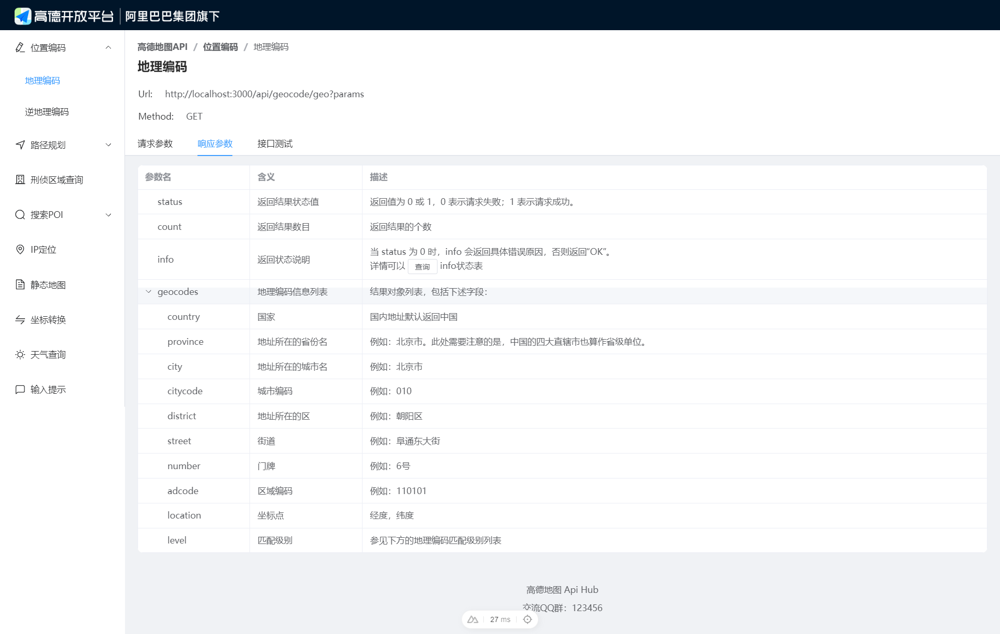

# 高德地图 Api Hub

使用**Nuxtjs**对高德地图官方的Api进行二次封装，添加了参数校验、日志记录功能。并且对官方文档进行二次重写，布局更美观优雅

## 安装

```bash
git clone https://github.com/yongqi02/GaoDeDiTu.git

cd GaoDeDiTu

npm install
```

## 初始化

在**config.ts**中设置高德地图的**Key**

## 运行

项目默认跑在 `http://localhost:3000`，可以修改**config.ts**中的**PORT**控制端口:

```bash
npm run dev
```

本地打开对应端口地址即可看见Api文档

